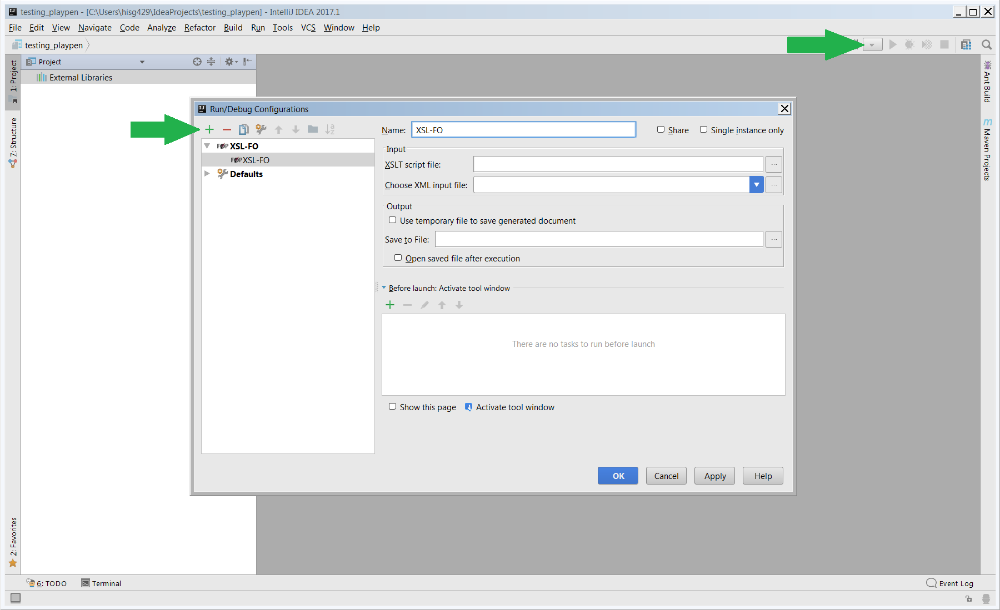

#XSL-FO Support for IntelliJ IDEA

This plugin provides run configuration that allows execution of XSL-FO transformations with [Apache FOP](https://xmlgraphics.apache.org/fop/) (Formatting Objects Processor).

The plugin can be installed within IntelliJ IDEA or by downloading the plugin from the [Jetbrains plugin repository](https://plugins.jetbrains.com/plugin/7736-xsl-fo-support-for-intellij-idea)

## Building the plugin

Simply run the runIde task using the gradle wrapper:

`./gradlew runIde`

## Using the plugin:

Download the FOP binary from [here](http://mirrors.ukfast.co.uk/sites/ftp.apache.org/xmlgraphics/fop/binaries/) and extract it somewhere on your system. Then configure the plugin to point to the root of the extracted directory.

Settings > Languages & Frameworks > XSL-FO

The plugin allows for a new XSL-FO run configuration

